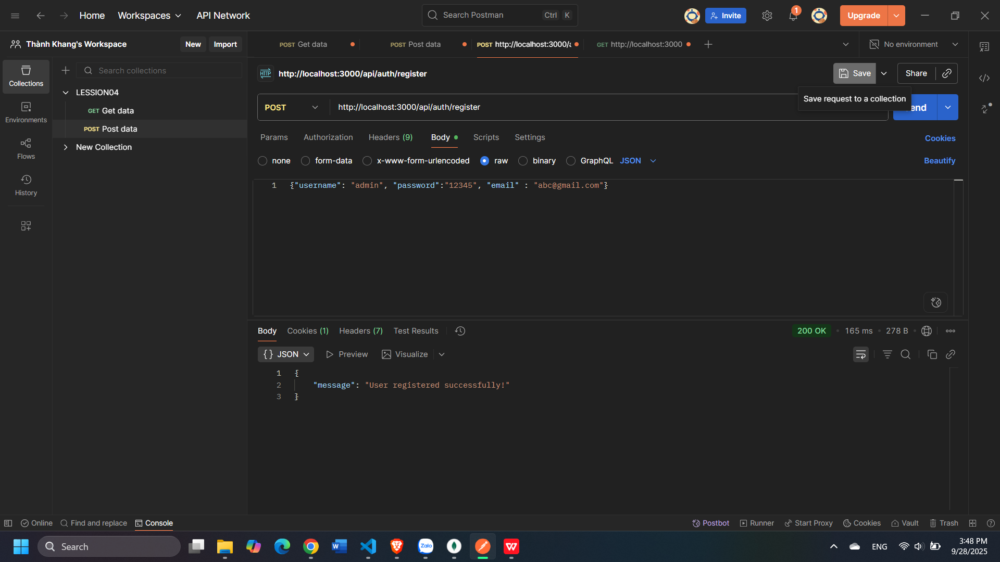
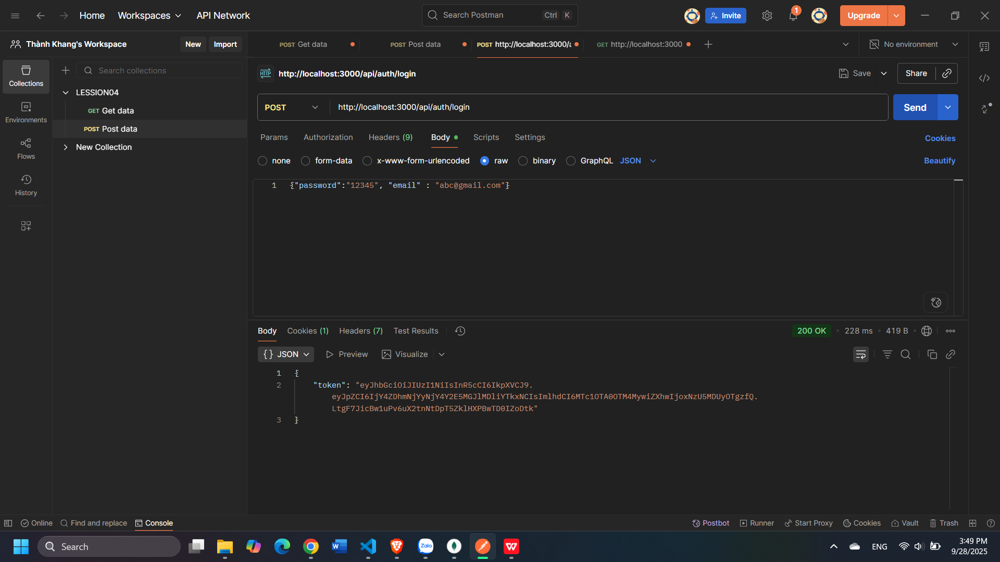
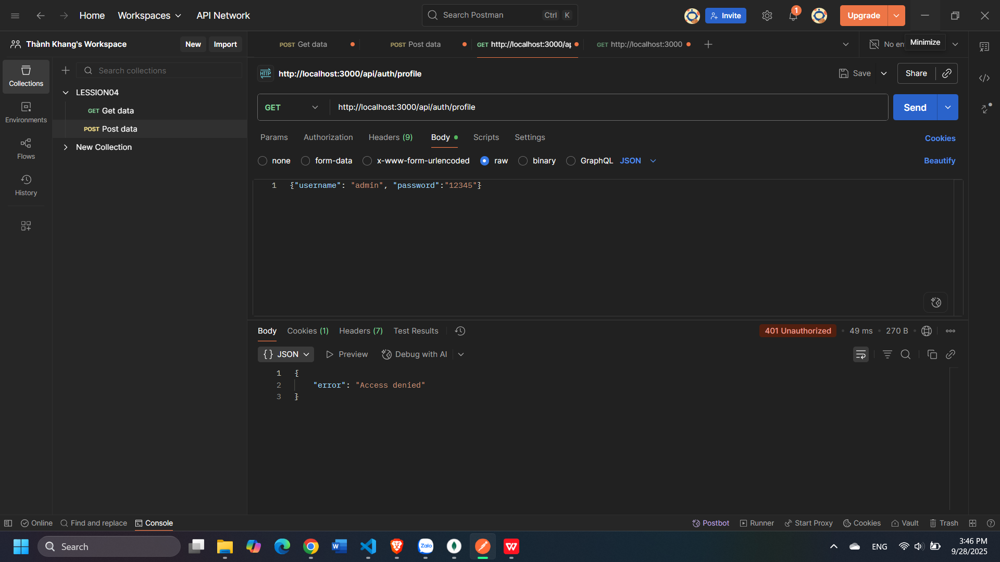
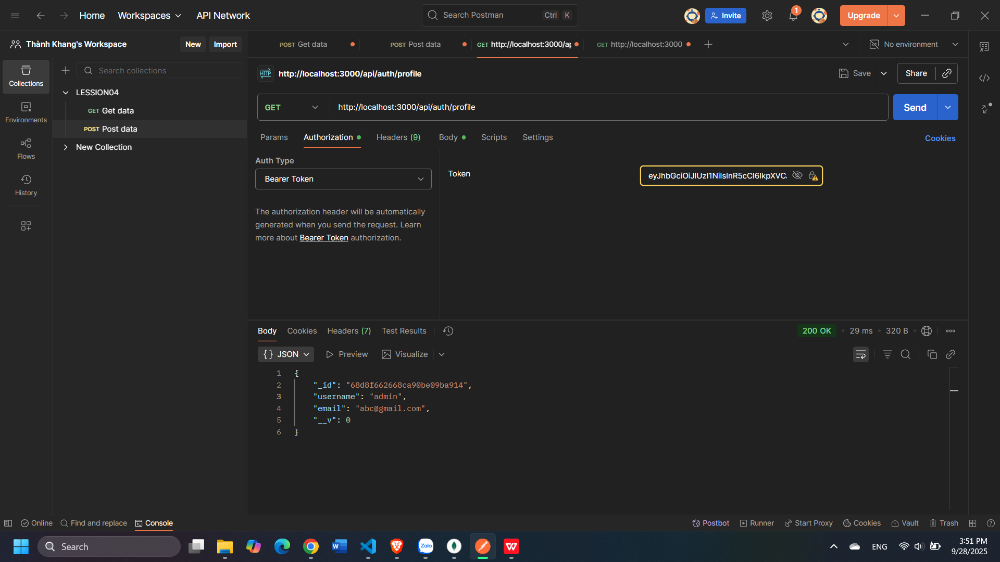

# Token Authentication 

##  Giới thiệu
Repo này minh họa cơ chế **xác thực bằng JWT (JSON Web Token)** trong Node.js.  
Ứng dụng có các chức năng chính:
- Đăng ký (Register)
- Đăng nhập (Login)
- Lấy thông tin Profile (cần token hợp lệ)

---

##  Cách chạy
npm install express
node app.js

## Kết Quả Test

## 1. Đăng ký (Register)

---

## 2. Đăng nhập (Login)

---

## 3. Truy cập Profile (không token → lỗi)

---

## 4. Truy cập Profile (có token hợp lệ)

##  Kết luận
- **Register**: Tạo tài khoản thành công.  
- **Login**: Nhận được JWT token.  
- **Profile**: Chỉ truy cập được khi gửi token trong header `Authorization: Bearer <token>`.  
- Token có thể hết hạn nếu được cấu hình `expiresIn`.  
